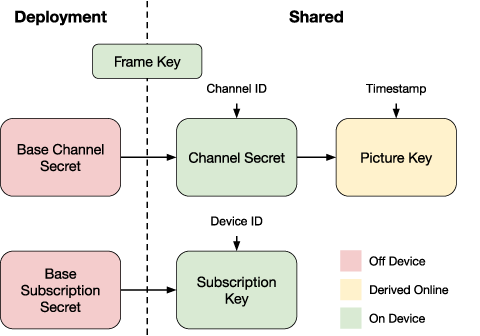

# Security Design

## Cryptography

At a high level, subscriptions are encrypted by authenticated encryption using a device-specific key. We aim to prevent retargeting or forging for a new device even in the event that one device is completely compromised. Additionally, subscriptions cannot be retargeted to a new channel even in the case of a compromised device key as every channel has a channel-specific key. On the other hand, frames are encrypted using a frame-specific key to ensure that retargeted frames are not even decrypted into their correct plaintext. 

In order to prevent key reuse, we use a key derivation function (KDF) to derive unique keys for Ascon in various contexts. For our KDF, we chose the Keccak Message Authentiation Code (KMAC) construction defined in [NIST SP800-185](https://doi.org/10.6028/NIST.SP.800-185).

We chose KMAC because it is fast and is more efficient than a traditional HMAC construction. This is in contrast to other KDFs like PBKDF2 or Argon2, which are designed to be slow to account for low entropy in passwords. All of our KDF usage will be keyed by 256 bits of entropy (32 bytes) from base secrets. Additionally, KMAC is an eXtendable Output Function (XOF) which allows us to derive keys of arbitrary length if needed.

### Primitives

$\mathsf{Ascon128_{Enc}}(K, P, D, N) \rightarrow (C, T)$  
$\mathsf{Ascon128_{Dec}}(K, C, T, D, N) \rightarrow (P)$  
Ascon-128 is an authenticated encryption scheme that takes a key $K$, a plaintext message $P$, associated data $D$, and a public nonce $N$ as input. It outputs a ciphertext $C$ and an authentication tag $T$. For decryption, it takes a key $K$, a ciphertext $C$, authentication tag $T$, associated data $D$, and a public nonce $N$ as input. It outputs the plaintext message $P$.

$\mathsf{KMAC}(K, X, L, S)$  
KMAC is Keccak's keyed message authentication code that takes a key $K$, a message $X$, and a domain separator $S$ as input. It outputs a tag of length $L$.

### Secrets

None of the secrets are stored and compiled into the firmware. Instead, they are injected into reserved flash regions after the firmware is built. In order to use secrets, they must be read into RAM. We derive `Zeroize` traits on all sensitive secret types to allow us to zeroize them in memory after they are no longer needed or dropped to mitigate attacks related to memory leakage.

**General Symbols**

$D$ - Decoder ID (4B)  
$C$ - Channel ID (4B)  
$T_{\mathsf{start}}$ - Start timestamp (8B)  
$T_{\mathsf{end}}$ - End timestamp (8B)  
$T_{\mathsf{frame}}$ - Frame timestamp (8B)  

**Deployment Secrets**

$S_{\mathsf{base\_sub}}$ - Base subscription secret (32B)  
$S_{\mathsf{base\_chan}}$ - Base channel secret (32B)  
$K_{\mathsf{frame}}$ - Frame key (16B)  

**Encoder/Decoder Secrets**

$K_{\mathsf{sub}}$ - Subscription key (16B), unique to decoder  
$S_{\mathsf{chan}}$ - Channel secret (32B), unique to channel  
$K_{\mathsf{pic}}$ - Picture key (16B), unique to channel and timestamp  

**Key Derivations**

$K_{\mathsf{sub}}^D = \mathsf{KMAC128}(S_{\mathsf{base\_sub}}, D, \mathsf{16B}, \mathsf{"derive\_subscription\_key"})$  

$S_{\mathsf{chan}}^C = \mathsf{KMAC256}(S_{\mathsf{base\_chan}}, C, \mathsf{32B}, \mathsf{"derive\_channel\_secret"})$  

$K_{\mathsf{pic}}^{C, T} = \mathsf{KMAC128}(S_{\mathsf{chan}}^C, (T_{\mathsf{frame}} || \sim T_{\mathsf{frame}}), \mathsf{16B}, \mathsf{"derive\_picture\_key"})$  

## Random Number Generation

The MAX78000 includes a "true" random number generator (TRNG) which is backed by hardware. However, the TRNG is a prime target for an attacker, who may attempt to manipulate or disable it. The TRNG is also very slow when it comes to sampling values.

Rather than use the TRNG directly, we opt to construct a CSPRNG upon initialization. The CSPRNG is a ChaCha20Rng construction that is seeded from a SHA3-256-HMAC construction. We first hash a static random seed from flash as an additional (but weak) source of entropy. Then, we perform 256 iterations of value collection from the TRNG, as well as the tick value from a peripheral timer which is collected immediately after the TRNG output.

We utilize the constructed CSPRNG for random delays to mitigate against fault injection attacks throughout the system.