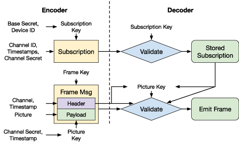

# Functional Requirements

## Build System

### Build Environment

We provide a Dockerfile which sets up the build environment for the Decoder. It simply installs the Rust toolchain and some `cargo` binaries. We have decided to use the LLVM toolchain shipped with Rust, rather than the ARM GNU toolchain to build the Decoder firmware.

- `cargo-binutils`: Provides quick access to LLVM tools, allowing us to run commands such as `cargo objcopy` or `cargo size` (practically drop-in replacements for `arm-none-eabi-objcopy` and `arm-none-eabi-size`).
- `cargo-make`: Allows running `Makefile.toml` files, which we use to describe the build flow for the Decoder. This is described in more detail in the "Build Decoder" section below.

### Build Deployment

This step is used to call `gen_secrets` to generate the global secrets or deployment secrets file. In our design, this step randomly generates $S_{base\_sub}$, $S_{base\_chan}$, and $K_{frame}$.

### Build Decoder

Running the built Docker image with the expected mounts and environment variables will trigger the following build flow:

- Pre-Docker: Cleans previously copied secrets and copies the `global.secrets` file into the `decoder/firmware-builder/` directory.
- build-release-flow:
  - Builds the `decoder.bin` file using the `decoder/max78000/`.
  - Runs the `firmware-builder` tool to inject the secrets at the end of the firmware file according to the flash layout specification. It also injects a lifetime subscription for channel 0 to allow decoding of emergency broadcasts. This generates `max78000.bin`.
- Post-Docker: Copies the output `max78000.bin` file from the firmware-builder execution to the `/out` directory.


## Encoder and Decoder

For most packed types/structs, we use `bincode` to serialize and deserialize the data.

### Generate Subscription

1. The Encoder derives the channel secret $S_{\mathsf{chan}}^{C}$ for the channel using the base channel secret $S_{\mathsf{base\_chan}}$ and the channel ID $C$.
2. The Encoder creates the subscription update package by encoding the channel ID $C$, start timestamp $T_{\mathsf{start}}$, end timestamp $T_{\mathsf{end}}$, and the channel secret $S_{\mathsf{chan}}^{C}$.
3. The Encoder derives the subscription key $K_{\mathsf{sub}}^{D}$ for the Decoder using the base subscription secret $S_{\mathsf{base\_sub}}$ and the Decoder ID $D$.
4. The Encoder encrypts the subscription update package using the subscription key $K_{\mathsf{sub}}^{D}$.
5. The Encoder emits the subscription update package to be sent to the Decoder.

### Encode Frame

1. The Encoder derives the channel secret $S_{\mathsf{chan}}^{C}$ for the channel using the base channel secret $S_{\mathsf{base\_chan}}$ and the channel ID $C$.
2. The Encoder derives the picture key $K_{\mathsf{pic}}^{C, T}$ for the channel and timestamp using the channel secret $S_{\mathsf{chan}}^{C}$ and the frame timestamp $T_{\mathsf{frame}}$.
3. The Encoder encrypts the picture using the picture key $K_{\mathsf{pic}}^{C, T}$.
4. The Encoder packs $C$, $T_{\mathsf{frame}}$, and the encrypted picture into a frame package.
5. The Encoder does an outer layer of encryption using frame key $K_{\mathsf{frame}}$.
6. The Encoder emits the encrypted frame to be sent to the Decoder.



### Update Subscription

1. The Decoder receives the subscription update package.
2. The Decoder retrieves its own subscription key $K_{\mathsf{sub}}^{D}$ from flash.
3. The Decoder decrypts and validates the subscription update package using $K_{\mathsf{sub}}^{D}$.
4. The Decoder searches for a matching channel ID $C$ in the subscription table in flash.
    - If an empty slot is found, the Decoder writes the new subscription to flash.
    - If a match is found, the Decoder erases the old subscription and writes the new subscription to flash.
    - If no match is found and no empty slot is found, the Decoder rejects the subscription update.

### Decode Frame

1. The Decoder receives the encrypted frame.
2. The Decoder decrypts the outer layer of the frame using the frame key $K_{\mathsf{frame}}$.
3. The Decoder retrieves the channel ID $C$ and timestamp $T_{\mathsf{frame}}$ from the frame metadata.
4. The Decoder searches for a matching channel ID $C$ in the subscription table in flash.
    - If no match is found, the Decoder rejects the frame.
5. The Decoder verifies that the timestamp $T_{\mathsf{frame}}$ is between $T_{\mathsf{start}}$ and $T_{\mathsf{end}}$ of the subscription. It also verifies that the timestamp is strictly greater than the last decoded timestamp.
    - If the timestamp is not valid, the Decoder rejects the frame.
6. The Decoder derives picture key $K_{\mathsf{pic}}^{C, T}$ for the channel and timestamp using the channel secret $S_{\mathsf{chan}}^{C}$ from the subscription and the frame timestamp $T_{\mathsf{frame}}$.
7. The Decoder decrypts the picture using the picture key $K_{\mathsf{pic}}^{C, T}$.
8. The Decoder displays the picture.

### List Subscriptions
1. The Decoder iterates over the subscription table in flash and retrieves the channel ID, start timestamp, end timestamp, for each subscription.
2. The Decoder emits the list of subscriptions.

## Flash Layout and State

We created a flash layout to store the Decoder's state. This includes the frame key and the subscription key. It also includes the subscription table, which can fit up to 9 entries. Each entry in the subscription table is stored in a separate flash page to allow for easy erasure and writing of subscriptions.

Note that the 0 index of the subscription table at address `0x1004_4000` is pre-populated with a lifetime subscription for channel 0 to allow decoding of emergency broadcasts. This is inserted by the `firmware-builder` tool, and also is the last page of flash that the firmware binary can occupy so that later pages can be indexed into (and are empty).

The subscription entries are stored in a packed format in little-endian order. Every 16 bytes requires the next 16 bytes to be its binary complement - this is used to detect potential flash corruption and invalidate subscription entries should this occur. The magic byte is `0x53`.

```
0x1004_0000┌───────────────────────────┐
           │Static Random Bytes        │
0x1004_2000├───────────────────────────┤
           │Frame Key (16B)            │
           │Subscription Key (16B)     │
0x1004_4000├───────────────────────────┤
           │Channel 0 Subscription     │
           │Magic (4B), Chan. ID (4B)  │
           │Magic (4B), Chan. ID (4B)  │
           │~Magic (4B), ~Chan. ID (4B)│
           │~Magic (4B), ~Chan. ID (4B)│
           │Start Timestamp (8B)       │
           │End Timestamp (8B)         │
           │~Start Timestamp (8B)      │
           │~End Timestamp (8B)        │
           │Channel Secret 1/2 (16B)   │
           │~Channel Secret 1/2 (16B)  │
           │Channel Secret 2/2 (16B)   │
           │~Channel Secret 2/2 (16B)  │
           ├───────────────────────────┤
0x1004_6000│Channel 1 Subscription     │
0x1004_8000│Channel 2 Subscription     │
0x1004_A000│Channel 3 Subscription     │
0x1004_C000│Channel 4 Subscription     │
0x1004_E000│Channel 5 Subscription     │
0x1005_0000│Channel 6 Subscription     │
0x1005_2000│Channel 7 Subscription     │
0x1005_4000│Channel 8 Subscription     │
0x1005_6000└───────────────────────────┘
```